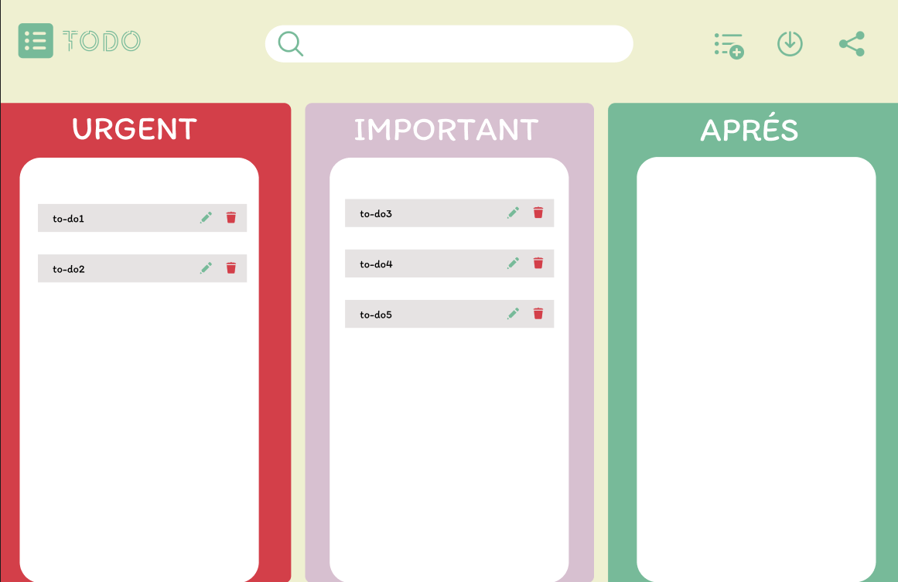

# to-do list 🌷

### EN Burn-Out ? ma todo-list est faite pour vous ✨

Cette todo-list est sectionnée en 3 parties :

- *Urgent*
- *Important*
- *Après*

***Pourquoi !?* Bah parce que chaque chose a son temps et au lieu de vous surmener, vous pourriez accomplir vos taches de manière progressive des *plus urgente* a celles qui les sont moins 😉**

<p align="center">
  
</p>


## Comment l'utiliser !?

### Dependences

- PHP
- MySQL
- **XAMPP** ou **WAMPP** (ou simplement Apache)

#### 1. Cloner mon repo GitHub 😗

```zsh
git clone https://github.com/lolorine16/Todo-list-php
```

#### 2. MySQL 🗄️✨

```zsh
sudo mysql -u root -p #(ou ton username) puis saisi ton mdp
```

#### 3. Créer votre base de donnée 👇

```mysql
CREATE DATABASE todo_db;
USE todo_db;
```

#### 4. Créer la table SQL dans la base de donnée 🗄️

```mysql
CREATE TABLE taches(
    id INT NOT NULL AUTO_INCREMENT PRIMARY KEY,
    contenu TEXT,
    statut ENUM('urgent','important','apres') DEFAULT 'apres'
);
```

*OU*

```zsh
cd Todo-list-php  #ensuite lancer MySQL
```
```mysql
SOURCE taches.sql
```

#### 5. Configuration de la base de données 😆✨✨

Configurez votre connexion à la base de données :

```zsh
cd Todo-list-php/php/

# Copiez le template et renommez-le
cp db.php.template db.php

# Modifiez le fichier avec vos paramètres
nano db.php
```

**⚠️ Important :** Modifiez les lignes suivantes dans `db.php` avec vos propres paramètres :
- `$username = "votre_nom_utilisateur";` → votre nom d'utilisateur MySQL
- `$password = "votre_mot_de_passe";` → votre mot de passe MySQL
- Ajustez `$host`, `$port` et `$dbname` si nécessaire

***check et c'est partie*** 🥰❤️✨

> **🔒 Note de sécurité :** Le fichier `db.php` contient vos informations de connexion sensibles. Il est automatiquement ignoré par Git (via `.gitignore`) pour protéger vos données personnelles.

#### 6. Pour finir ❤️✨

```zsh
php -S localhost:8003
```
  
*Quand tout est bon ✨* **tape dans ton navigateur 👉**

```txt
http://localhost:8003/index.html
```

# Les Choses a améliorer

- [ ] Modifier le statut des taches avec la fonctionnalité **Drag**

- [ ] Modifier les statut de certaines taches **immédiatement avec AJAX**